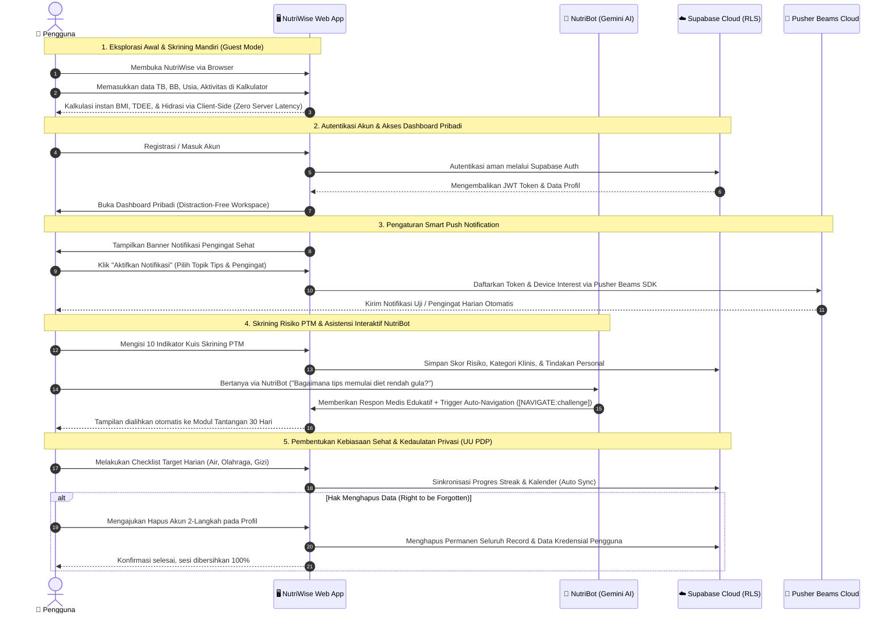

<div align="center">

  # NutriWise
  ### *An Intelligent Digital Platform for Personalized Nutrition, Disease Prevention, and Healthy Lifestyle*
  **"Masa Depan Sehat & Sejahtera Dimulai dari Langkah Kecil Hari Ini"**

  <p align="center">
    Inovasi platform kesehatan digital interaktif berbasis web untuk mewujudkan <b>Sustainable Development Goals (SDG) 3: Kehidupan Sehat dan Sejahtera (Good Health & Well-Being)</b>.
  </p>

  <p align="center">
    <a href="#-latar-belakang--urgensi"></a>
    <a href="#-teknologi-yang-digunakan"></a>
    <a href="#-teknologi-yang-digunakan"></a>
    <a href="#-arsitektur--keamanan-data"></a>
    <a href="#-kebijakan-privasi--keamanan-data-pengguna"></a>
  </p>

  ---
</div>

## 📑 Daftar Isi
- [📌 Latar Belakang & Urgensi](#-latar-belakang--urgensi)
- [🎯 Korelasi dengan SDG 3](#-korelasi-dengan-sdg-3)
- [✨ Fitur Utama & Inovasi Unggulan](#-fitur-utama--inovasi-unggulan)
- [🏗️ Arsitektur Sistem & Alur Kerja](#️-arsitektur-sistem--alur-kerja)
- [🛡️ Kebijakan Privasi & Keamanan Data Pengguna (Kepatuhan UU PDP)](#️-kebijakan-privasi--keamanan-data-pengguna-kepatuhan-uu-pdp)
- [🎨 Desain UI/UX & Filosofi Estetika](#-desain-uiux--filosofi-estetika)
- [💻 Teknologi yang Digunakan](#-teknologi-yang-digunakan)
- [🚀 Panduan Instalasi & Menjalankan Aplikasi](#-panduan-instalasi--menjalankan-aplikasi)
- [📁 Struktur Direktori Proyek](#-struktur-direktori-proyek)
- [👥 Tim Pengembang](#-tim-pengembang)

---

## 📌 Latar Belakang & Urgensi

Di era modern, pergeseran pola konsumsi masyarakat Indonesia ke arah makanan tinggi kalori, gula, garam, dan lemak jenuh (GGL), dipadukan dengan gaya hidup sedentari (*sedentary lifestyle*), telah memicu lonjakan signifikan kasus **Penyakit Tidak Menular (PTM)** seperti Diabetes Melitus Tipe 2, Hipertensi, Obesitas, dan Penyakit Jantung Koroner. 

Faktor utama yang memperburuk kondisi ini antara lain:
1. **Rendahnya Literasi Gizi Klinis**: Maraknya disinformasi, mitos diet ekstrem tanpa dasar medis, serta klaim produk kesehatan semu (*pseudoscience*) di media sosial.
2. **Ketiadaan Alat Skrining Mandiri yang Terjangkau & Holistik**: Kebanyakan masyarakat baru mengetahui kondisi kesehatannya ketika komplikasi klinis telah terjadi.
3. **Barrier Aplikasi Kesehatan Konvensional**: Aplikasi yang ada seringkali rumit, berbayar mahal, dibanjiri iklan invasif, dan mengeksploitasi data privasi pengguna tanpa transparansi.

**NutriWise** hadir sebagai jembatan edukatif dan preventif interaktif: platform web kesehatan berbasis bukti medis (*evidence-based*) yang mudah diakses oleh seluruh lapisan masyarakat secara gratis, ramah pengguna, berorientasi privasi, dan menyenangkan.

---

## 🎯 Korelasi dengan SDG 3

Proyek ini secara spesifik mengusung subtema **SDGs 3: Kehidupan Sehat dan Sejahtera (Good Health and Well-Being)** dengan fokus kontribusi nyata pada:

* **Target 3.4**: *Mengurangi sepertiga kematian dini akibat penyakit tidak menular (PTM) melalui pencegahan dan pengobatan, serta mempromosikan kesehatan mental dan kesejahteraan.*
  > **Realisasi NutriWise**: Menyediakan modul skrining mandiri faktor risiko PTM (Diabetes, Hipertensi, Jantung), kalkulasi energi & hidrasi terpersonalisasi, serta edukasi gizi preventif sebelum timbul gejala kronis.
* **Target 3.d**: *Memperkuat kapasitas deteksi dini, pengurangan risiko, dan pengelolaan risiko kesehatan nasional dan global.*
  > **Realisasi NutriWise**: Memberdayakan individu dengan data kesehatan objektif (BMI, TDEE, Profil Risiko) dan rekomendasi tindakan personal untuk perubahan gaya hidup bertahap.

---

## ✨ Fitur Utama & Inovasi Unggulan

### 1. 🧮 Kalkulator Kesehatan Klinis Interaktif (Multi-Parameter)
Bukan sekadar kalkulator sederhana, modul kalkulator NutriWise menggunakan formula medis standar internasional:
- **Indeks Massa Tubuh (BMI)**: Mengadopsi standar batas *Asia-Pacific WHO Guidelines*. Hasil kalkulasi secara cerdas terintegrasi (*auto-sync*) ke modul Kuis Skrining sebagai parameter objektif pertama.
- **Kebutuhan Kalori Harian (TDEE & BMR)**: Dihitung menggunakan **Persamaan Mifflin-St Jeor** (standar emas klinis terkini yang lebih akurat dibandingkan rumus Harris-Benedict lama), dikombinasikan dengan faktor aktivitas fisik (*Physical Activity Level*).
- **Kalkulator Kebutuhan Air (Hidrasi)**: Estimasi volume cairan berbasis berat badan (35 ml/kg) yang disesuaikan secara dinamis dengan intensitas beban aktivitas harian.

### 2. 🩺 Kuis Skrining Risiko PTM (Early Risk Assessment)
- **Algoritma Skor Berbobot (Weighted Risk Scoring)**: 10 indikator terstruktur yang mencakup integrasi BMI riil, pola makan (sayur/buah, konsumsi gula, gorengan/lemak trans, natrium), aktivitas fisik (standar WHO 150 menit/minggu), riwayat genetik keluarga, paparan tembakau (aktif/pasif), durasi tidur, dan tingkat stres harian.
- **Stratifikasi Risiko 4-Tingkat**: Mengkategorikan pengguna ke dalam *Risiko Rendah*, *Risiko Sedang*, *Risiko Tinggi*, dan *Risiko Sangat Tinggi*.
- **Sub-Kategori Analitik**: Memberikan diagnosis visual terhadap 3 domain utama: *Risiko Metabolik*, *Risiko Kardiovaskular*, dan *Risiko Gaya Hidup*.
- **Triggered Actionable Recommendations**: Menghasilkan daftar rekomendasi personal konkret berdasarkan respon spesifik yang memicu skor bahaya pengguna.

### 3. 🃏 Mitos vs Fakta Gizi (Interactive 3D Card Flip)
- Modul edukasi interaktif untuk meluruskan 6 miskonsepsi diet populer (misal: mitos air es membekukan lemak, bahaya melewatkan sarapan, pembatasan buah saat diet, makan malam, hingga mitos diet jus detoks).
- Desain *card-flip* 3D dengan visualisasi ergonomis dan penjelasan ilmiah ringkas namun berbasis literatur medis.

### 4. 🔥 30-Day Health Habit Challenge (Gamified Habit Formation)
- Menerapkan prinsip *behavioral habit loops* untuk membangun kebiasaan sehat berkelanjutan.
- **Fleksibilitas Target Kustom**: Pengguna dapat menambahkan target kuantitatif (Liter, Menit, Porsi) maupun boolean dengan frekuensi yang dapat diatur (harian, 2 hari sekali, mingguan).
- **Indikator Real-time**: Streak api aktif, persentase keberhasilan harian, log kalender 30 hari, serta pencatatan otomatis.

### 5. 🔄 Arsitektur Dual-State (Guest Landing Page vs. Dedicated Dashboard)
- **Guest / Publik**: Landing page imersif dengan *single-page storytelling* dan akses instan ke edukasi tanpa registrasi yang memaksa.
- **Authenticated User**: Dashboard pribadi *distraction-free* dengan navigasi sidebar lateral (*1 feature per page*), riwayat kuis, sinkronisasi cloud, dan manajemen akun mandiri.

### 6. 🤖 NutriBot AI: Asisten Kesehatan Virtual Cerdas (Google Gemini Engine)
- Didukung model bahasa mutakhir **Google Gemini AI** via Vercel Serverless Function terenkripsi (`/api/chat`).
- **Strict Medical Ethics & Guidelines**: Dirancang khusus dengan *system prompt guardrails* (edukasi gizi preventif, bebas klaim diagnosis mandiri tanpa dasar medis, dan deteksi peringatan kegawatdaruratan).
- **Intelligent Page Navigation**: NutriBot mampu memicu aksi alih halaman otomatis (*smart context navigation trigger*) seperti `[NAVIGATE:challenge]` atau `[NAVIGATE:kalkulator]` untuk memandu aksi konkret pengguna secara langsung.

### 7. 🔔 Smart Web Push Notifications (Pusher Beams & Service Worker)
- Mendorong kedisiplinan dan pembentukan kebiasaan hidup sehat (*health habit retention*) dengan pengingat ramah harian langsung di perangkat (*desktop & mobile*).
- Terintegrasi dengan **Pusher Beams Cloud** dan **PWA Background Service Worker** yang hemat daya.
- Dilengkapi pusat kontrol preferensi notifikasi terperinci di header dashboard pengguna (Pengingat Minum Air, Tips Nutrisi Harian, dan Evaluasi Risiko PTM) beserta fitur uji coba interaktif.


---

## 🏗️ Arsitektur Sistem & Alur Kerja

NutriWise dirancang dengan arsitektur **Multi-Tier Decoupled & Privacy-First** yang mengutamakan pemrosesan lokal (*local-first*), responsivitas instan, modularitas tinggi, dan keamanan data sesuai regulasi:

### 1. 🎨 Diagram Arsitektur Multi-Tier (Komponen & Topologi Layanan)

```mermaid
flowchart TD
    %% === Definisi Style & Warna ===
    classDef userNode fill:#2F6323,stroke:#1B3D14,stroke-width:2px,color:#FFFFFF,font-weight:bold;
    classDef appCore fill:#ECFDF5,stroke:#059669,stroke-width:2px,color:#064E3B,font-weight:bold;
    classDef clientUI fill:#E0F2FE,stroke:#0284C7,stroke-width:2px,color:#0C4A6E;
    classDef aiLayer fill:#F5F3FF,stroke:#7C3AED,stroke-width:2px,color:#4C1D95;
    classDef notifLayer fill:#FFFBEB,stroke:#D97706,stroke-width:2px,color:#78350F;
    classDef storageLayer fill:#F8FAFC,stroke:#475569,stroke-width:2px,color:#0F172A;
    classDef securityLayer fill:#FEF2F2,stroke:#DC2626,stroke-width:2px,color:#7F1D1D;

    User(["👤 Pengguna (Desktop / Tablet / Mobile Browser)"]):::userNode
    User -->|Akses Web via HTTPS| App["🚀 NutriWise Core App (React 18 + Vite SPA)"]:::appCore

    %% === Layer Frontend SPA ===
    subgraph FE ["🖥️ CLIENT PRESENTATION LAYER (React 18 + Vite SPA)"]
        Router{"Routing & Auth Guard"}:::clientUI
        App --> Router
        
        Router -->|Tamu / Guest| Landing["🌐 Landing Page Publik (Storytelling)"]:::clientUI
        Router -->|Terautentikasi| Dashboard["📊 Dedicated Dashboard Workspace"]:::clientUI

        Landing --> Hero["🌿 Hero & Edukasi SDG 3"]:::clientUI
        Landing --> CalcGuest["🧮 Kalkulator Nutrisi Klinis"]:::clientUI
        Landing --> MythGuest["🃏 Mitos vs Fakta 3D Flip"]:::clientUI
        Landing --> QuizTeaser["🩺 Kuis Skrining PTM (Teaser)"]:::clientUI

        Dashboard --> DashHabit["🔥 30-Day Health Challenge & Habit Loops"]:::clientUI
        Dashboard --> DashCalc["📈 Kalkulator Nutrisi & BMR Tracker"]:::clientUI
        Dashboard --> DashQuiz["📋 Kuis Skrining PTM (Full 10-Indikator)"]:::clientUI
        Dashboard --> DashMyth["💡 Mitos vs Fakta Nutrisi"]:::clientUI
        Dashboard --> DashProfile["⚙️ Profil Pengguna & Privasi Data"]:::clientUI

        ChatbotWidget["💬 NutriBot AI Floating Widget"]:::aiLayer
        NotifManager["🔔 Notification Center & Header Controls"]:::notifLayer
        Dashboard -.-> ChatbotWidget
        Dashboard -.-> NotifManager
    end

    %% === Layer Serverless & Layanan Cloud AI/Notifikasi ===
    subgraph API_MIDDLEWARE ["⚡ SERVERLESS & CLOUD INTELLIGENCE LAYER"]
        VercelAPI["⚡ Vercel Serverless Function (/api/chat)"]:::aiLayer
        GeminiAI["🤖 Google Gemini AI Engine (@google/genai)"]:::aiLayer
        PusherBeams["📡 Pusher Beams Push Notification Cloud"]:::notifLayer
        ServiceWorker["⚙️ Background Service Worker (PWA Web Push)"]:::notifLayer

        ChatbotWidget -->|POST Prompt & Halaman Aktif| VercelAPI
        VercelAPI -->|Generative Medical-Guideline AI| GeminiAI
        GeminiAI -.->|Respon Edukatif + Auto-Navigation Trigger| ChatbotWidget

        NotifManager -->|Register Interests & Preferences| PusherBeams
        PusherBeams -->|Web Push Protocol / Payload| ServiceWorker
        ServiceWorker -->|Native OS Push Notification| User
    end

    %% === Layer Data & Privasi ===
    subgraph DATA_PERSISTENCE ["🛡️ DATA PERSISTENCE & PRIVACY-BY-DESIGN"]
        LocalStorage[("💾 Client LocalStorage (Offline Cache / Local-First)")]:::storageLayer
        SupabaseAuth[("☁️ Supabase Cloud Database (PostgreSQL)")]:::storageLayer
        PDPPolicy["🔒 UU PDP Compliant Guard (TLS + JWT + RLS)"]:::securityLayer

        CalcGuest -.->|Client-Side Only (Tanpa Server)| LocalStorage
        DashHabit <-->|Instant Read/Write Cache| LocalStorage
        DashHabit ===>|Auto Cloud Sync| SupabaseAuth
        DashQuiz ===>|Simpan Histori Risiko & Rekomendasi| SupabaseAuth
        DashProfile <===>|Manajemen Akun & Right-to-be-Forgotten| SupabaseAuth
        SupabaseAuth --- PDPPolicy
    end

    %% Subgraph Styling
    style FE fill:#F0FDF4,stroke:#16A34A,stroke-width:2px,color:#14532D
    style API_MIDDLEWARE fill:#FAF5FF,stroke:#9333EA,stroke-width:2px,color:#581C87
    style DATA_PERSISTENCE fill:#F8FAFC,stroke:#475569,stroke-width:2px,color:#0F172A
```

---

### 2. 🔄 Diagram Alur Kerja Pengguna Terintegrasi (End-to-End User Flow)



---

## 🛡️ Kebijakan Privasi & Keamanan Data Pengguna (Kepatuhan UU PDP)

NutriWise mengedepankan prinsip *Privacy-by-Design*:

| Prinsip Keamanan | Implementasi pada NutriWise |
|---|---|
| **Local-First Processing** | Perhitungan BMI, kalori, dan kebutuhan air dilakukan langsung di mesin pengguna (*client-side*). Data tidak dikirimkan ke server jika pengguna tidak login. |
| **Kepatuhan Regulasi** | Dirancang dengan mengacu pada prinsip transparansi dan persetujuan **UU Perlindungan Data Pribadi (UU No. 27 Tahun 2022)**. |
| **Zero Ad-Trackers** | 100% bebas dari pelacak iklan pihak ketiga (*no third-party tracking cookies* / *no telemetry surveillance*). |
| **Enkripsi Cloud & RLS** | Data akun yang disinkronisasi ke basis data Supabase dilindungi protokol enkripsi TLS serta otentikasi ketat berbasis token JWT. |
| **Right to be Forgotten** | Tersedia mekanisme **Hapus Akun Permanen 2-Langkah** di menu profil, menjamin hak pengguna untuk menghapus seluruh metadata dan riwayat kesehatannya kapan pun. |

---

## 🎨 Desain UI/UX & Filosofi Estetika

Desain antarmuka NutriWise mengusung estetika **Modern Botanical & Clinical Elegance** yang menenangkan:
* **Palet Warna Harmonis**:
  - `Forest Green (#2F6323)`: Menyimbolkan vitalitas, kesegaran, dan pertumbuhan kesehatan.
  - `Sage Green (#558949)`: Warna aksen sekunder yang ramah dan menyejukkan mata.
  - `Warm Cream (#FAF9F6)`: Mengurangi ketegangan mata (*eye-strain reduction*) dibandingkan latar putih murni.
  - `Slate Dark (#1E293B)`: Menjamin rasio kontras teks yang memenuhi standar aksesibilitas WCAG AA/AAA.
* **Tipografi Terkurasi**:
  - *Fraunces* & *Lora*: Memberikan sentuhan editorial bergengsi dan ramah (*approachable editorial tone*).
  - *Plus Jakarta Sans*: Sans-serif modern karya desainer Indonesia yang memiliki *readability* tinggi pada layar digital.
* **Mikro-Interaksi Halus**:
  - Animasi rotasi ikonik pada kartu mitos vs fakta.
  - State indikator interaktif dan transisi mulus saat perpindahan navigasi.

---

## 💻 Teknologi yang Digunakan

| Kategori | Teknologi | Kegunaan |
|---|---|---|
| **Core Framework** | React 18.3 | Library komponen antarmuka reaktif, modular, dan berperforma tinggi |
| **Build Tool** | Vite 6.1 | Modul bundler ultra-cepat dengan Hot Module Replacement (HMR) instan |
| **Styling** | Vanilla Modern CSS | Performa render maksimal, arsitektur modular tanpa overhead runtime |
| **Generative AI** | Google Gemini AI (`@google/genai`) | Asisten nutrisi cerdas interaktif berbasis pedoman medis & auto-navigation |
| **Serverless API** | Vercel Serverless Functions | Backend microservice tanpa server untuk komunikasi AI yang aman |
| **Push Notification** | Pusher Beams & Web Push API | Layanan pengingat kebiasaan harian berbasis background Service Worker PWA |
| **Iconography** | Lucide React | Ikon modern, konsisten, dan ringan berformat SVG murni |
| **Backend & Auth** | Supabase JS v2 | Layanan autentikasi akun, penyimpanan metadata pengguna, dan sinkronisasi awan |
| **Design Standards** | Figma & Web Standards | Rancang bangun antarmuka responsif ramah seluler (*mobile-first*) |

---

## 🚀 Panduan Instalasi & Menjalankan Aplikasi

Ikuti panduan ringkas berikut untuk menjalankan NutriWise di lingkungan lokal (*local development*):

### 1. Prasyarat Sistem
* [Node.js](https://nodejs.org/) (versi 18.x atau yang lebih baru direkomendasikan)
* NPM atau Yarn package manager
* Git

### 2. Kloning Repositori
```bash
git clone https://github.com/dababayou/NutriWise.git
cd NutriWise
```

### 3. Instalasi Dependensi
```bash
npm install
```

### 4. Konfigurasi Environment Variables
Salin file template lingkungan `.env.example` menjadi `.env`:
```bash
cp .env.example .env
```
Sesuaikan kredensial Supabase Anda di dalam `.env`:
```env
VITE_SUPABASE_URL=https://your-project-id.supabase.co
VITE_SUPABASE_ANON_KEY=your-supabase-anon-key
VITE_PUSHER_BEAMS_INSTANCE_ID=your-pusher-beams-instance-id
GEMINI_API_KEY=your-google-gemini-api-key
```
> *Catatan: Jika kredensial Supabase dikosongkan, NutriWise secara otomatis mengaktifkan **Mode Mock/Demo Terintegrasi** sehingga penguji juri tetap dapat mengeksplorasi seluruh fitur akun secara penuh tanpa kendala koneksi.*

### 5. Menjalankan Server Development
```bash
npm run dev
```
Buka peramban dan navigasikan ke `http://localhost:3000`.

### 6. Membangun Bundle Produksi
```bash
npm run build
npm run preview
```

---

## 📁 Struktur Direktori Proyek

```text
NutriWise/
├── api/                        # Vercel Serverless Functions
│   └── chat.js                 # Handler AI Gemini dengan prompt medis & navigasi
├── assets/                     # Aset gambar grafis & visual pendukung
├── public/                     # Aset statis & Service Worker PWA
│   ├── hero_bg.png             # Latar belakang hero landing page
│   ├── logo.png                # Logo resmi NutriWise
│   ├── dino_logo.png           # Aset visual pendukung
│   └── service-worker.js       # Background worker untuk Web Push Notifications
├── src/
│   ├── components/             # Komponen modular aplikasi
│   │   ├── AuthModal.jsx       # Modal dialog autentikasi cepat
│   │   ├── AuthPage.jsx        # Halaman autentikasi login & registrasi split-view
│   │   ├── Challenge30Days.jsx # Modul pelacak kebiasaan 30-Day Health Challenge
│   │   ├── Chatbot.jsx         # Widget asisten pintar NutriBot AI (Gemini)
│   │   ├── DashboardLayout.jsx # Tata letak dashboard pengguna dengan sidebar responsif
│   │   ├── Footer.jsx          # Komponen footer dan rincian lisensi
│   │   ├── Hero.jsx            # Banner pengantar landing page dengan tipografi
│   │   ├── Kalkulator.jsx      # Kalkulator BMI, Mifflin-St Jeor, & Hidrasi
│   │   ├── KuisSkrining.jsx    # Kuis 10 indikator risiko PTM & rekomendasi
│   │   ├── KuisTeaser.jsx      # Pratinjau kuis interaktif untuk tamu
│   │   ├── MitosFakta.jsx      # Kartu edukasi nutrisi 3D Flip
│   │   ├── Navbar.jsx          # Navigasi utama dengan deteksi sesi & notifikasi
│   │   ├── NotificationBanner.jsx # Banner ajakan aktivasi notifikasi pengingat
│   │   ├── NotificationSettingsModal.jsx # Modal preferensi & uji notifikasi Beams
│   │   ├── PrivacyModal.jsx    # Modal kebijakan privasi data pengguna (UU PDP)
│   │   ├── ProfileModal.jsx    # Manajemen profil dan hak hapus akun permanen
│   │   └── Sidebar.jsx         # Navigasi sidebar terpadu untuk dashboard
│   ├── lib/
│   │   ├── pushNotifications.js # Handler Pusher Beams SDK & Service Worker
│   │   └── supabase.js         # Konfigurasi klien dan validasi koneksi Supabase
│   ├── App.jsx                 # Pengatur status aplikasi utama & router tampilan
│   ├── index.css               # Desain sistem global, variabel CSS, & tipografi
│   └── main.jsx                # Titik masuk utama React DOM
├── .env.example                # Templat variabel lingkungan
├── index.html                  # Dokumen HTML utama dengan konfigurasi SEO
├── package.json                # Rincian paket dependensi dan script eksekusi
└── vite.config.js              # Konfigurasi bundler Vite
```

---


## 👥 Tim Pengembang

Proyek ini dirancang dan dikembangkan dengan penuh dedikasi oleh:

* **Idea, Concept, and Documentation**: Chelsea Franssiska Putri Gautama
* **UI/UX Designer and QA**: Kevin Marcelino Porobaten
* **Fullstack Developer**: Bayu Nismara Nagatama

---

<div align="center">
  <p>Dibuat dengan ❤️ untuk Masa Depan Indonesia yang Lebih Sehat & Berkelanjutan.</p>
  <p><b>NutriWise © 2026 — All Rights Reserved.</b></p>
</div>
